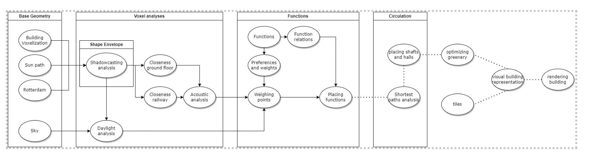

# Configuring 
# Process

## REL-chart

With the created set of program requirements, we created a diagram to specify the preferences and the preferred spatial qualities.

Each function will need to be linked to another function. Some are strongly coupled, while others are less strongly coupled. To gain a comprehensive overview, we have listed the functions. Each function is assessed in relation to other functions through weights ranging from 0 (lowest weight) to 1 (highest weight).

  
<em>Table 2.1: REL-chart</em>

  

For the parking spaces, bike spaces, and the restaurant, it was crucial that these be located close to the street and the beer garden. These functions must remain easily accessible for both the building residents and visitors. 
Furthermore, it is paramount that the elderly units are situated near the care centre for the elderly and the gym. Seniors require physical activity and should have access to assistance within a short distance. Conversely, it is beneficial for physiotherapists and nurses to be close to the homes of the elderly to provide optimal support. 
For all units in the building, it is also important that they can easily reach the laundry rooms. Often, there may be an elevator or corridor involved before reaching the designated space. The only consideration is to avoid mixing elderly units with various other residential units. Older individuals generally prefer a more tranquil environment in their living spaces. Nevertheless, integrating the elderly with the youth and other demographics can create a sense of community and prevent them from feeling isolated. 
Finally, it seemed like a good idea to have a courtyard on the ground level. A communal space where different people can come together, including residents of the building, visitors, and individuals from the surrounding area. 
Then we also created another rel-chart of what features should meet based on various analyses.

  
<em>Table 2.2: REL-chart extension</em>

  

For all inhabited spaces (residences, care center, gym, and restaurant), we have stipulated that sunlight should be able to enter, and the same applies to the sky view factor. It is noteworthy that the elderly units have high weights (specifically 1) for these aspects because it has been proven that seniors often recover more quickly when there is something to observe, and they can see/hear nature. It is important to pay special attention to the view and sunlight for the elderly. While preferences for the other units also exist, they are comparatively less critical. 

Additionally, it is crucial that other functions outside the building, such as the Beer Garden and the courtyard, receive an adequate amount of sunlight. The building should not obstruct light for these existing structures. 

Furthermore, it is important, especially for residential units, to minimize the impact of loud noises from the surroundings. The project location is adjacent to the railway, so this factor needs to be taken into account. 

For certain functions, it is also vital that they are situated close to the ground floor. Initially, we determined that communal spaces should primarily be close to the ground level. The higher the building, the more private it becomes. Additionally, it was important for parking spaces to be underground, so we assigned a value to them in relation to all other functions. 

## Flowchart 

To facilitate the process as effectively as possible, we have maintained a flowchart outlining the progression of the process leading to the creation of the building. Various components need to be investigated. Through the use of the flowchart, it becomes clearer for us to determine the approach and make progress in the project. 

## Determining voxel size 

For the algorithmic design of the building. Small voxels had to be created. These voxels indicate the internal volumes of the generated building. The voxel size has to be chosen wisely to prevent creating awkward or unusable spaces. The height of a voxel is based on the height of one floor of the building. Because of "Bouwbesluit", the ceiling of newbuild housing space has to lie at 2.6 meters high. To design a nice buffer for ceiling/floor thickness, it was decided to put the height of the voxel at 3.2 meters. The area of the voxel should be square since that's the nicest to work with. This area is based on the minimum area needed for a wheelchair to turn ([Figure 1](#wheelchair-turn)) and the standard wingspan of a person ([Figure 2](#Person-size)). This resulted in a voxel size of 1.8x1.8x3.2 (WxLxH) m^3.

  

    
    
<em>Figure 2.1: Wheelchair 180 degrees turn with one wheel at a fixed point</em>

  

  

    
    
<em>Figure 2.2: Person height and arm span</em>

  

<!--

  
  

  <em>Figure 2.1: Wheelchair 180 degrees turn with one wheel at a fixed point</em>

  
  
<em>Figure 2.2: Person height and arm span</em>

-->
source: prof. ir. Haak, A.J.H. & ir. Leever-van der Burgh, D., "De Menselijke Maat", Delftse universitaire pers (1980)

## Voxellizing 

The concluding step in the configuration process involves utilizing the specified voxel size to generate a lattice derived from the mandatory envelope. We generated the surrounding city of Rotterdam into the area to determine how big the envelope could be. 

