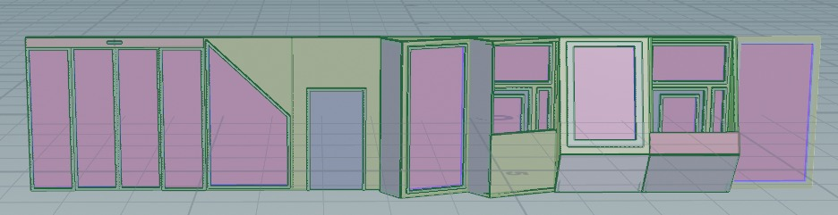

# Forming 
## Floorplan
...

## Facades

It aimed to create an interesting and appealing structure that radiates unity and creates a comfortable environment. 
This all needed to be included in the design, without losing  its functionality.

Because of the location, the design faces some challenges, for example, noise from the trains and Biergarten, and optimizing sunlight. 
Also, the design process accounted for factors such as privacy and the maximizing use of greenery. This way, habitants and visitors would feel safe and at ease in the building.

### Tile set

  
  <em>Figure 4.1: Tiles set</em>

For the lower floors, the facades had to be welcoming and open. The design of the facades on these floors uses big, rectangular windows with a triangular cut-out. This creates a triangular wave across the floor.

The floors above are mostly expected to be housing. For these floors sunlight and noise reduction are more important. Also in the spirit of creating unity across the building, the triangular theme was re-introduced in these types of facades. For the North and East sides of the building, the majority of the noise pollution is expected to be from directly below the facades from the trains or Biergarten. For the other two sides of the building, the majority of the noise pollution will come sideways from these noise sources. Therefore, two similar but different kinds of facades were created. The facades on the North and East sides will form horizontal lines and a hanging shape, and the facades on the South and West sides will have quite similar shapes, however, these will be vertical or standing shapes.

(figures)

These tiles all have a non-window side. These will be aimed at the main source of the noise and will have a sound-reducing material. The window will allow more noise into the room/building. Therefore this side of the facades will face the other way. Using the concept "if you can't see it, you can't hear it" allows less noise to enter the rooms through the windows. Although this creates lessened noise pollution, it has to be noted this won't fully resolve the noise problem per definition. Using plants for the top of the balcony railings will help improve temperature control and it creates a less industrial or concrete construction look. The greenery on the balcony might even help a little bit with noise reduction but this will be minimal.

For the area, it's important to have nice green areas. The little amount of greenery that will be lost in the construction of the building has to be made up for. Better would be better if more greenery were placed than initially was placed at the location. Therefore, it was chosen to use green roofs. The tile corresponding to the roof is shown below
(roof tile figure)
