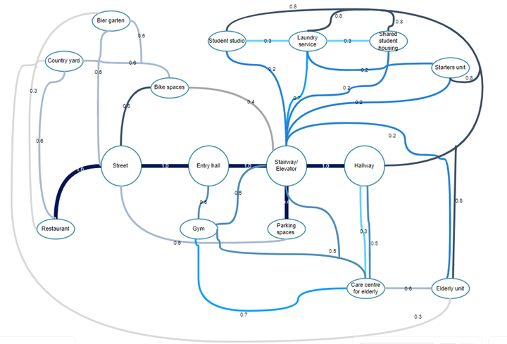

# Forming 
## Voxels
For the algorithmic design of the building. Small voxels had to be created. These voxels indicate the internal volumes of the generated building. The voxel size has to be chosen wisely to prevent creating awkward or unusable spaces. The height of a voxel is based on the height of one floor of the building. Because of "Bouwbesluit", the ceiling of newbuild housing space has to lie at 2.6 meters high. To design a nice buffer for ceiling/floor thickness, it was decided to put the height of the voxel at 3.2 meters. The area of the voxel should be square since that's the nicest to work with. This area is based on the minimum area needed for a wheelchair and the standard wingspan of a person. 

source: prof. ir. Haak, A.J.H. & ir. Leever-van der Burgh, D., "De Menselijke Maat", Delftse universitaire pers (1980)

## Facades

It aimed to create an interesting and appealing structure that radiates unity and creates a comfortable environment. 
This all needed to be included in the design, without losing  its functionality.

Because of the location, the design faces some challenges, for example, noise from the trains and Biergarten, and optimizing sunlight. 
Also, the design process accounted for factors such as privacy and the maximizing use of greenery. This way, habitants and visitors would feel safe and at ease in the building.

### Tile set
For the lower floors, the facades had to be welcoming and open. The design of the facades on these floors uses big, rectangular windows with a triangular cut-out. This creates a triangular wave across the floor.

The floors above are mostly expected to be housing. For these floors sunlight and noise reduction are more important. Also in the spirit of creating unity across the building, the triangular theme was re-introduced in these types of facades. For the North and East sides of the building, the majority of the noise pollution is expected to be from directly below the facades from the trains or Biergarten. For the other two sides of the building, the majority of the noise pollution will come sideways from these noise sources. Therefore, two similar but different kinds of facades were created. The facades on the North and East sides will form horizontal lines and a hanging shape, and the facades on the South and West sides will have quite similar shapes, however, these will be vertical or standing shapes.

(figures)

These tiles all have a non-window side. These will be aimed at the main source of the noise and will have a sound-reducing material. The window will allow more noise into the room/building. Therefore this side of the facades will face the other way. Using the concept "if you can't see it, you can't hear it" allows less noise to enter the rooms through the windows. Although this creates lessened noise pollution, it has to be noted this won't fully resolve the noise problem per definition. Using plants for the top of the balcony railings will help improve temperature control and it creates a less industrial or concrete construction look. The greenery on the balcony might even help a little bit with noise reduction but this will be minimal.

##
##
##
**400 students units:**

- 25% single student studio’s with bathroom and kitchen (min 25m^2)
- 50% multi dwelling apartment for 4 students with shared bathroom, kitchen and living space (min 25m^2 per student)
- 25% multi dwelling apartments for 8 students (min 25m^2 per student)

Multi dwellings must be separated from the elderly units and the starter units because of the nuisance.

**200 elderly units:**

- All units must be single level, accessible by elevator and wheelchair, exterior space needed when space is larger than 40m2 with sunlight of min. 5m^2
- 50% Independent living
- 50% Assisted living
- Assisted living in close range to care centre and physical-therapy center

**200 starter units**

- Two-bedroom units:
  - Safe for children (no split-level)
  - Shared outdoor space for children to play around

**Overall units:**

- Living space within the units requires equivalent daylight area minimum of 0.5m^2

This building is going to be mixed-use with the following usage functions:

- Care centre for elderly
  - Accessible by elevator, wheelchair
- Shared working space
- Gym/sport centre
- Restaurant

**Area requirements / exterior requirements**

**Parking**

- A parking requirement of 1.33 bike parking spot per resident
- 0.8 car parking spot per appropriate dwelling
- Separate 10 bike parking spots and 4 car parking spots per 200 m^2
- Bike and car parking for dwellings should be secure and only accessible for residents, while the additional bike and car parking should be publicly accessible.

**Greenery**

- Areas for greenery equal to the total surface area of the plot (approx. 8,000m^2 excluding the Biergarten) should be kept on the plot. Apply more greenery on green roofs, vertical façades, stepped terraces, etc...
- The building will incorporate a system for rain harvesting. This system should at least be able to collect and store rainwater from the site but preferably also the neighborhood. Part of the stored water should be reused by the building complex

**Safety & Privacy**

- A degree of social control should be present in your design for the building complex. This means that public spaces such as inner courtyards or corridors should be visible from at least a few dwellings, so that there is some ‘overview’ by residents.

### List of full spaces 
The square meters in the table are based on average values for housing/restaurants/sports schools in Rotterdam/Netherlands. 

| Function               | Amount | Area per unit (m2) | Voxels per unit (2.25 m2) | Total Area (m2) | Voxels (2.25 m2) |
|------------------------|--------|---------------------|----------------------------|------------------|------------------|
| Elderly units (assisted) | 100    | 60                  | 27                         | 6,000            | 2,700            |
| Elderly units (independent) | 100    | 85                  | 38                         | 8,500            | 3,800            |
| Starter units          | 200    | 85                  | 38                         | 17,000           | 7,600            |
| Student studios        | 200    | 25                  | 12                         | 2,500            | 1,200            |
| 4 students shared      | 26     | 121                 | 54                         | 1,573            | 702              |
| 8 students shared      | 12      | 240                 | 107                        | 1,440            | 642              |
| Elderly care           | 1      | 850                 | 378                        | 850              | 378              |
| Gym                    | 1      | 140                 | 63                         | 140              | 63               |
| Restaurant             | 1      | 140                 | 63                         | 140              | 63               |
| Laundry room             | 1      | 100                 | 45                         | 100              | 45               |
| Car park               | 1      | 10,200              | 4,534                      | 10,200           | 4,534            |
| Bicycle park           | 1      | 852                 | 379                        | 852              | 379              |
| Main hall + mailboxes  | 1      | >100                | >45                        | >100             | >45              |
| **Total**              | -      | -                   | -                          | >49,396          | >22,151          |

## Product

### Bubble diagram
The bubble diagram shows which spaces are connected, and how important these connections are. Through the different colors and numbers, it can be read which connection is more important between certain spaces. 

### Exterior context relationships

 

