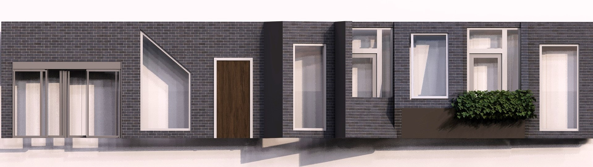

# Forming 
## Floorplan
...

## Facades

It aimed to create an interesting and appealing structure that radiates unity and creates a comfortable environment. 
This all needed to be included in the design, without losing  its functionality.

Because of the location, the design faces some challenges, for example, noise from the trains and Biergarten, and optimizing sunlight. 
Also, the design process accounted for factors such as privacy and the maximizing use of greenery. This way, habitants and visitors would feel safe and at ease in the building.

### Tile set

In Figures 4.1 and 4.2, the full facade tile set is shown. It consists of 8 tiles. However, in the figure, 9 tiles are shown. the first two shown tiles are the same tile but mirrored. 

  
  
<em>Figure 4.1: Tiles set</em>

  
  
<em>Figure 4.2: Tiles set after rendering</em>

For the lower floors, the facades had to be welcoming and open. The design of the facades on these floors uses big, rectangular windows with a triangular cut-out. This is the third tile shown in Figures 4.1 and 4.2. This creates a triangular wave across the floor as shown in Figure 4.3.

  
  
<em>Figure 4.3: Facades with trianglular wave</em>

The floors above are mostly expected to be housing. For these floors sunlight and noise reduction are more important. Also in the spirit of creating unity across the building, the triangular theme was re-introduced in these types of facades. For the North and East sides of the building, the majority of the noise pollution is expected to be from directly below the facades from the trains or Biergarten. For the other two sides of the building, the majority of the noise pollution will come sideways from these noise sources. Therefore, two similar but different kinds of facades were created. The facades on the North and East sides will form horizontal lines and a hanging shape (tiles 5 and 6 in Figures 4.1 and 4.2), and the facades on the South and West sides will have quite similar shapes, however, these will be vertical/standing shapes (tiles 7 and 8 in Figures 4.1 and 4.2).
These tiles all have a non-window side. These will be aimed at the main source of the noise and will have a sound-reducing material. The window will allow more noise into the room/building. Therefore this side of the facades will face the other way. Using the concept "if you can't see it, you can't hear it" allows less noise to enter the rooms through the windows. Although this creates lessened noise pollution, it has to be noted this won't fully resolve the noise problem per definition. Using plants for the top of the balcony railings will help improve temperature control and it creates a less industrial or concrete construction look. The greenery on the balcony might even help a little bit with noise reduction but this will be minimal.

In Figures 4.1 and 4.2, there are two more tiles shown, the 4th and the last tile. The 4th tile is used as an emergency exit and the last tile is a big window, used at inward corners where the usual facades can't be used due to lack of space.

For the area, it's important to have nice green areas. The little amount of greenery that will be lost in the construction of the building has to be made up for. Better would be better if more greenery were placed than initially was placed at the location. Therefore, it was chosen to use green roofs. The tile corresponding to the roof is shown on the right in Figure 4.4. In this figure, also the floor tile is shown, left of the roof tile.

  
  
<em>Figure 4.4: Floor and roof tiles</em>

## Placing the correct tiles using houdini
This subsection describes how we placed the abovementioned tileset on the voxelcloud using Houdini. To parametrically make such a design is quite a difficult task. But also quite rewarding, since this last step finally gives you a visual representation of the building we have been designing so far. Placing these tiles went as follows.

Since the tiles should have the same dimensions as the voxels, we started by building a voxel only building by using a copy to points and fuse SOP. This allows us to have access to different orientated walls, by selecting primitives with correctly orientated normals. We created 4 groups: floors, ceilings, roofs and facades.

The floors were placed by copying the floor tiles onto the primitives and rotating them according to the voxel rotation. The ceilings were done in a similar manner except their normal direction was reversed. The roof tiles have been placed by manually selecting the upper most floors. This was not done parametrically and is thus a form of post processing. This was because of the design decision to include a walkable area in the hole of the building.

The facades facing north and east were selected by their normals, and this selection was reversed to get the facades facing south and west. Placing balconies was done by placing one every 5 tiles. The lowest 4 floors were each put in a different group based on their height. Then each floor got a different tile to use. The emergency exits were placed manually.

### Corners
If you look closely you might spot a problem with these tile placements. That is, tiles placed on inward corners clash with eachother (see image). An attempted solution was for each occupied voxel keeping track of neighbouring voxels, to determine a neighbour count. This however was not enough to determine if an inward corner has been placed, only for outward corners. A better solution would have been to for each unoccupied voxel, determine if they have 2 or more occupied neighbours. If so, replace the tiles with the inward corner tile.

