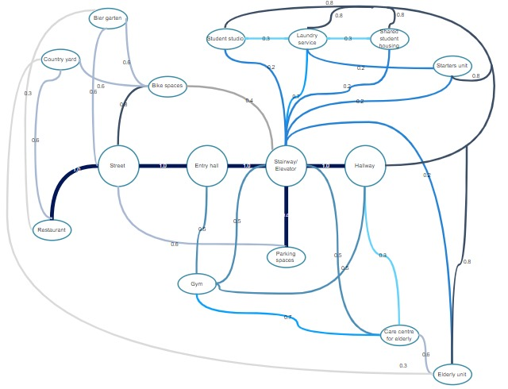
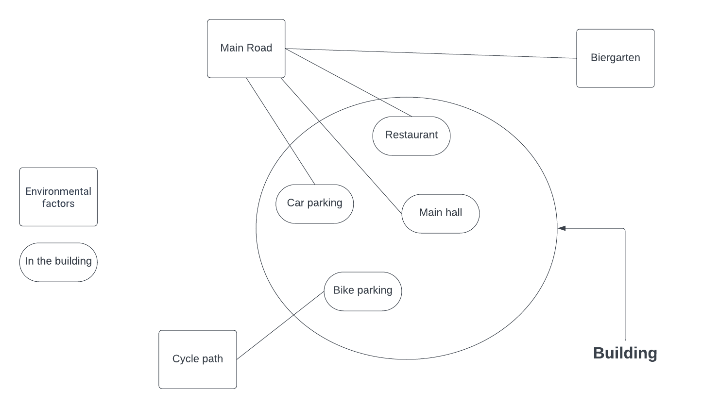

<!--
# Planning 
## Proces
### Design goals
The goal of this project is to design a building at the schieblock, located in Rotterdam. Before designing a building, we thought about what our goals for the building are. And what facilities the building should have. According to the assignment there should be space for 400 student units, 200 starter units and 200 elderly units. In addition, it was decided to create common areas. There is a goal policy which contains: 
1. Green
2. Safe 
3. Togetherness 
4. Sustainable 
5. accesisble

In addition, we want to adhere to the following rules: 
- Create a space where different residents can come together.  
- The building is not only a place to live, but also a place to find relaxation in the common areas or with other residents 

### Residents
The building must require a total of 800 units which are divided with:

**400 students units:**

- 25% single student studio’s with bathroom and kitchen (min 25m^2)
- 50% multi dwelling apartment for 4 students with shared bathroom, kitchen and living space (min 25m^2 per student)
- 25% multi dwelling apartments for 8 students (min 25m^2 per student)

Multi dwellings must be separated from the elderly units and the starter units because of the nuisance.

**200 elderly units:**

- All units must be single level, accessible by elevator and wheelchair, exterior space needed when space is larger than 40m2 with sunlight of min. 5m^2
- 50% Independent living
- 50% Assisted living
- Assisted living in close range to care centre and physical-therapy center

**200 starter units**

- Two-bedroom units:
  - Safe for children (no split-level)
  - Shared outdoor space for children to play around

**Overall units:**

- Living space within the units requires equivalent daylight area minimum of 0.5m^2

This building is going to be mixed-use with the following usage functions:

- Care centre for elderly
  - Accessible by elevator, wheelchair
- Shared working space
- Gym/sport centre
- Restaurant

**Area requirements / exterior requirements**

**Parking**

- A parking requirement of 1.33 bike parking spots per resident
- 0.8 car parking spot per appropriate dwelling
- Separate 10 bike parking spots and 4 car parking spots per 200 m^2
- Bike and car parking for dwellings should be secure and only accessible for residents, while the additional bike and car parking should be publicly accessible.

**Greenery**

- Areas for greenery equal to the total surface area of the plot (approx. 8,000m^2 excluding the Biergarten) should be kept on the plot. Apply more greenery on green roofs, vertical façades, stepped terraces, etc...
- The building will incorporate a system for rain harvesting. This system should at least be able to collect and store rainwater from the site preferably also the neighborhood. Part of the stored water should be reused by the building complex

**Safety & Privacy**

- A degree of social control should be present in your design for the building complex. This means that public spaces such as inner courtyards or corridors should be visible from at least a few dwellings so that there is some ‘overview’ by residents.

### List of full spaces 
The square meters in the table are based on average values for housing/restaurants/sports schools in Rotterdam/Netherlands. 

| Function               | Amount | Area per unit (m2) | Voxels per unit (3.24 m2) | Total Area (m2) | Voxels (3.24 m2) |
|------------------------|--------|---------------------|----------------------------|------------------|------------------|
| Elderly units (assisted) | 100    | 60                | 19                         | 6,000            | 1,900            |
| Elderly units (independent) | 100    | 85             | 24                         | 8,500            | 2,400            |
| Starter units          | 200    | 85                  | 24                         | 17,000           | 4,800            |
| Student studios        | 200    | 25                  | 8                          | 5,000            | 1,600            |
| 4 students shared      | 26     | 121                 | 37                         | 3,146            | 962              |
| 8 students shared      | 12     | 240                 | 74                         | 2,880            | 888              |
| Elderly care           | 1      | 850                 | 262                        | 850              | 262              |
| Gym                    | 1      | 140                 | 43                         | 140              | 43               |
| Restaurant             | 1      | 140                 | 43                         | 140              | 43               |
| Laundry room           | 1      | 100                 | 31                         | 100              | 31               |
| Car park               | 1      | 10,200              | 3,148                      | 10,200           | 3,148            |
| Bicycle park           | 1      | 852                 | 263                        | 852              | 263              |
| Main hall + mailboxes  | 1      | >100                | >31                        | >100             | >31              |
| **Total**              | -      | -                   | -                          | >54,908          | >16,371          |

## Product

### Bubble diagram
The bubble diagram shows which spaces are connected, and how important these connections are. Through the different colors and numbers, it can be read which connection is more important between certain spaces. 

### Exterior context relationships

-->

 

