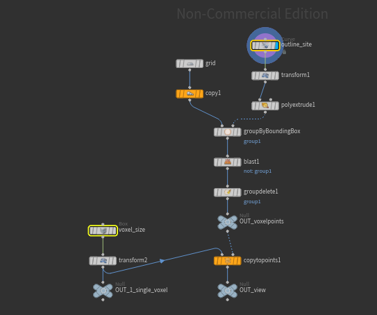
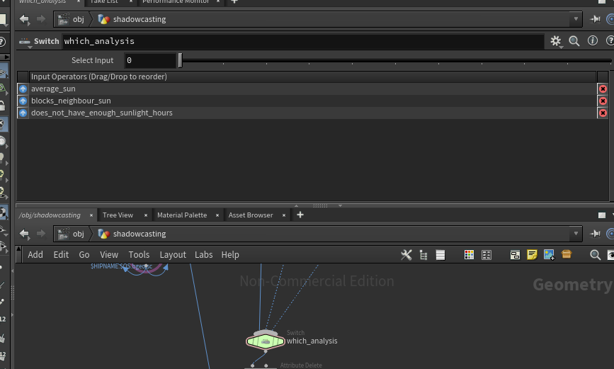
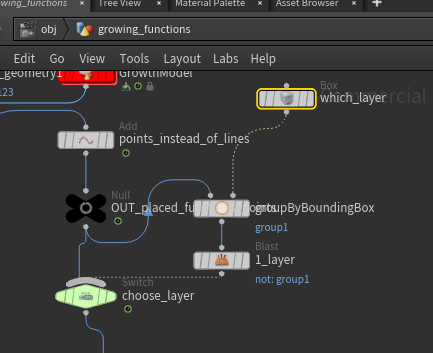

# How to use our model
In this chapter we describe how to use our model to procedurally generate your own building. We first talk about creating your own site and voxel cloud. Then we dive into analysing your voxel cloud. Then we tell how you would generate functions in your building. At last we tell you how to place tiles on your building.

## Voxel Cloud
Firstly place the grid at the location of your site. Then using the outline_site node create your outline. By then adjusting the voxel_size node to your own size, you have finished building your voxel cloud.

  
  
<em>Figure 1: In these nodes you build your starting voxel cloud</em>

## Analysing
The shadowcasting node does not need any configuring. However, you can choose which analysis to visualize using the which_analysis switch node.

  
  
<em>Figure 2: In these nodes you set which analysis to view</em>

The daylight and the ground analysis also dont need any configuring.

## Generating Functions
The Weighing_Points geometry needs a CSV file with functions and weighings. Input this file in the weighing_import node. After that, if you do not have 3 analyses, set the amount of analyses you did in the remove_0, remove_1 and average node. This will finish the configuration of the Weighing_Points geometry.

In the growing_functions geometry, first tune the parameters in the make_grid node, until you have a nicely connected grid. And after again importing the same CSV file, the algorithm works correctly. You can also view only one layer, useful for making floormaps, by using the choose_layer switch. By then setting the "height" parameter in the which_layer node, you choose the visible layer.

  
  
<em>Figure 3: Nodes where you can set single layer view</em>

## Placing tiles

Placing tiles is mostly non-parametric. But if you have tiles with the correct voxel dimension and import them above the Input_facade_tiles node are halfway there. You can then use the attribute "type", to set which type of tile gets placed where. In our model this is done using alot of attribute wrangles.
